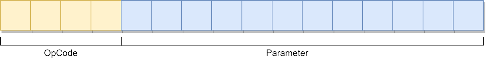
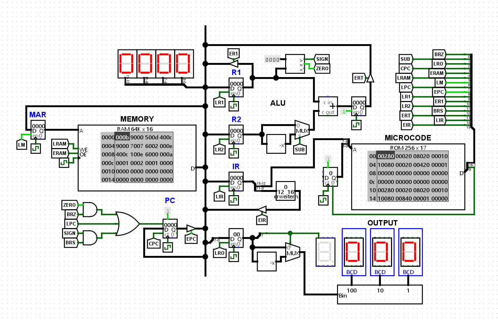

# Logisim CPU
Implementation of a simple microcode-controlled 16-bit CPU using Logisim-evolution.

## Instruction set
Instructions are described in a custom-made high level language which can be compiled to a sequence of microcode operations. The source code for the default instruction set can be found in [microcode.txt](microcode/microcode.txt). Before it can be loaded into the sequencer's ROM chip, the source file has to be translated using the aforementioned compiler which can be found [here](https://github.com/oskar2517/microcode-compiler).

Each instruction is 16-bit wide with the four most significant bits being used to store the opcode.


### Instructions
Refer to the [assembler](https://github.com/oskar2517/logisim-assembler) I created to translate programs from assembly to machine code. For writing more complex programs, a custom high level language can be used instead. More information about it can be found [here](https://github.com/oskar2517/logisim-compiler).
| OpCode | Mnemonic | Parameter | Description                                                           |
|--------|----------|-----------|-----------------------------------------------------------------------|
| 0x0    | ld       | \<addr\>  | Loads value at \<addr\> into register R1.                             |
| 0x1    | st       | \<addr\>  | Stores value in register R1 at \<addr\>.                              |
| 0x2    | ldr      | \<addr\>  | Loads value of address stored at \<addr\> into register R1.           |
| 0x3    | str      | \<addr\>  | Stores value of register R1 at address stored at \<addr\>.            |
| 0x4    | add      | \<addr\>  | Adds value stored at \<addr\> to value in register R1.                |
| 0x5    | sub      | \<addr\>  | Subtracts value stored at \<addr\> from value in register R1.         |
| 0x6    | jmp      | \<addr\>  | Jumps unconditionally to \<addr\>.                                    |
| 0x7    | brz      | \<addr\>  | Jumps to \<addr\> if `zero` flag is set.                              |
| 0x8    | brs      | \<addr\>  | Jumps to \<addr\> if `signed` flag is set.                            |
| 0x9    | mao      |           | Moves value of R1 to output register.                                 |

### Example program
Program that counts in alternation from 0 to 10 and then restarts.
```
start:
    ld ten
    mao
loop:
    sub two
    add one
    mao
    brz exit
    jmp loop
exit:
    ld iter
    add one
    st iter
    jmp start

ten:
    10

one:
    1

two:
    2

iter:
    0
```

## Video
https://github.com/oskar2517/minimal-cpu/assets/12718920/e34e6197-9a74-4a32-b7f9-e43b96adf1f7


## Screenshots


## Related projects
- Microcode compiler: https://github.com/oskar2517/microcode-compiler
- Assembler: https://github.com/oskar2517/logisim-assembler
- High level programming language compiler: https://github.com/oskar2517/logisim-compiler
